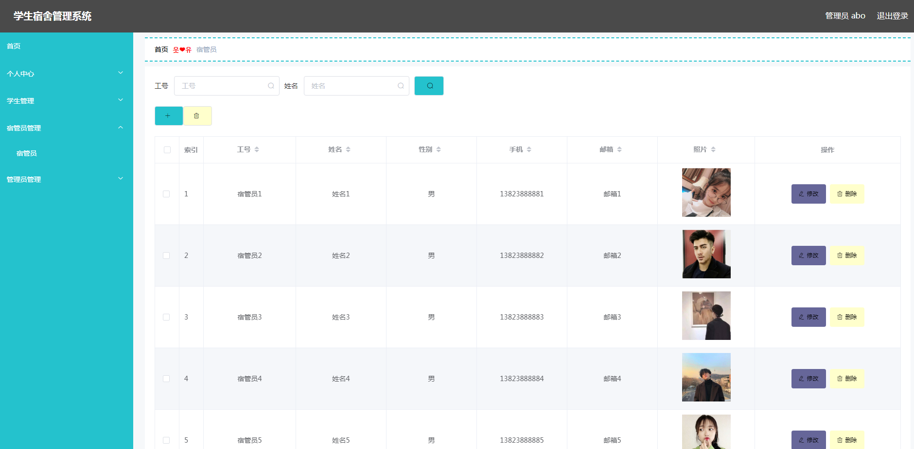
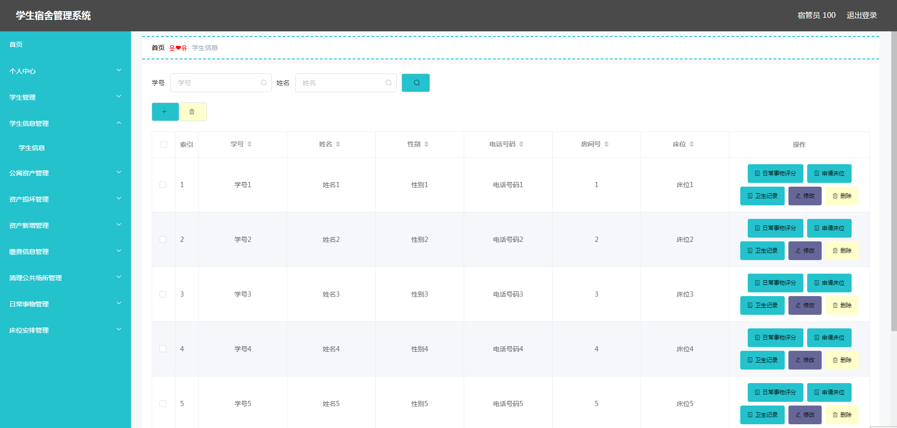
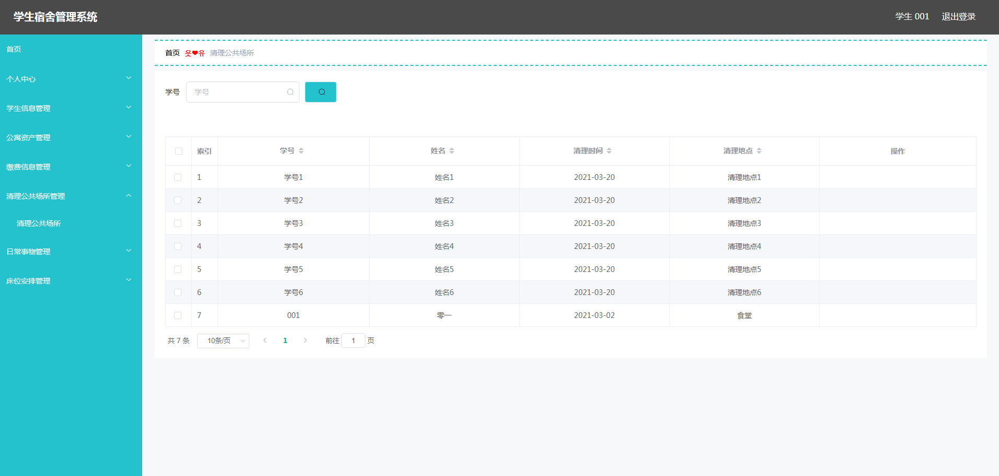
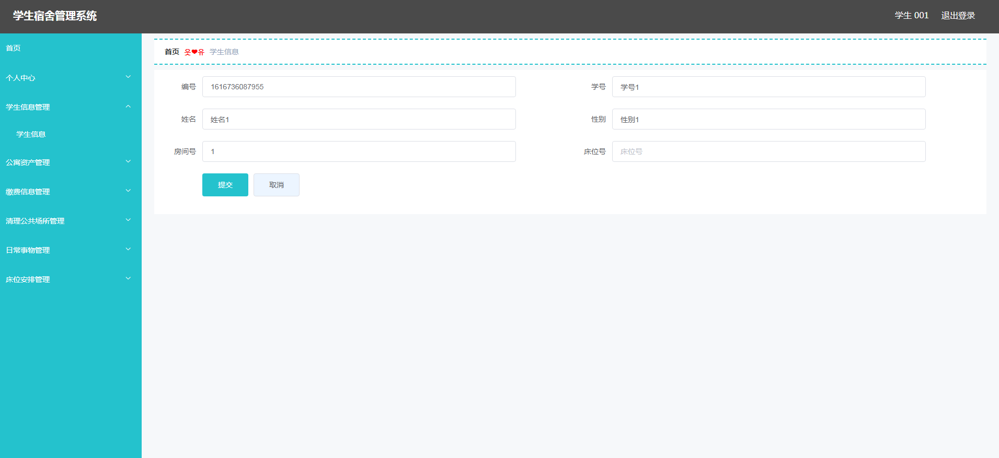

基于Springboot的学生宿舍管理系统
=
### 完整代码获取地址：从戎源码网 ([https://armycodes.com/](https://armycodes.com/))
### 作者微信：19941326836  QQ：952045282 
### 承接计算机毕业设计、Java毕业设计、Python毕业设计、深度学习、机器学习
### 选题+开题报告+任务书+程序定制+安装调试+论文+答辩ppt 一条龙服务
### 所有选题地址https://github.com/nature924/allProject

一、项目介绍
---
系统包含两种角色：用户、管理员，系统分为前台和后台两大模块，主要功能如下：

### 1 管理员功能实现

宿管员管理 
管理员可以对宿管员的资料进行管理，包括新增、修改、删除等操作。

学生管理 
管理员可以对学生信息进行管理，包括增、删、改、查操作。

### 2宿管员功能实现

学生信息管理 
宿管员可以进行学生信息的增、删、改、查操作，管理学生的床位申请、卫生记录和日常事务评分。

公寓资产管理 
宿管员可以管理公寓资产，登记资产损坏信息。

缴费信息管理 
宿管员可以进行缴费信息的增、删、改操作。

床位安排管理 
宿管员可以审核学生的床位安排信息。

### 3  学生功能实现

清理公共场所 
学生可以查看自己负责清理的公共场所信息。

申请床位 
学生可以选择床位号进行床位申请，宿管员审核通过后，学生才能使用申请的床位。

日常事务 
学生可以查看日常事务的加分项和评分标准信息。

缴费信息 
学生可以查看住宿费用及缴费时间等信息。

二、项目技术
---
- 编程语言：Java
- 数据库：MySQL
- 项目管理工具：Maven
- 前端技术：VUE、HTML、Jquery、Bootstrap
- 后端技术：Spring、SpringMVC、MyBatis

三、运行环境
---
- 操作系统：Windows、macOS都可以
- JDK版本：JDK1.8以上都可以
- 开发工具：IDEA、Ecplise、Myecplise都可以
- 数据库: MySQL5.7以上都可以
- Tomcat：任意版本都可以
- Maven：任意版本都可以

四、运行截图
---

### 程序截图：

